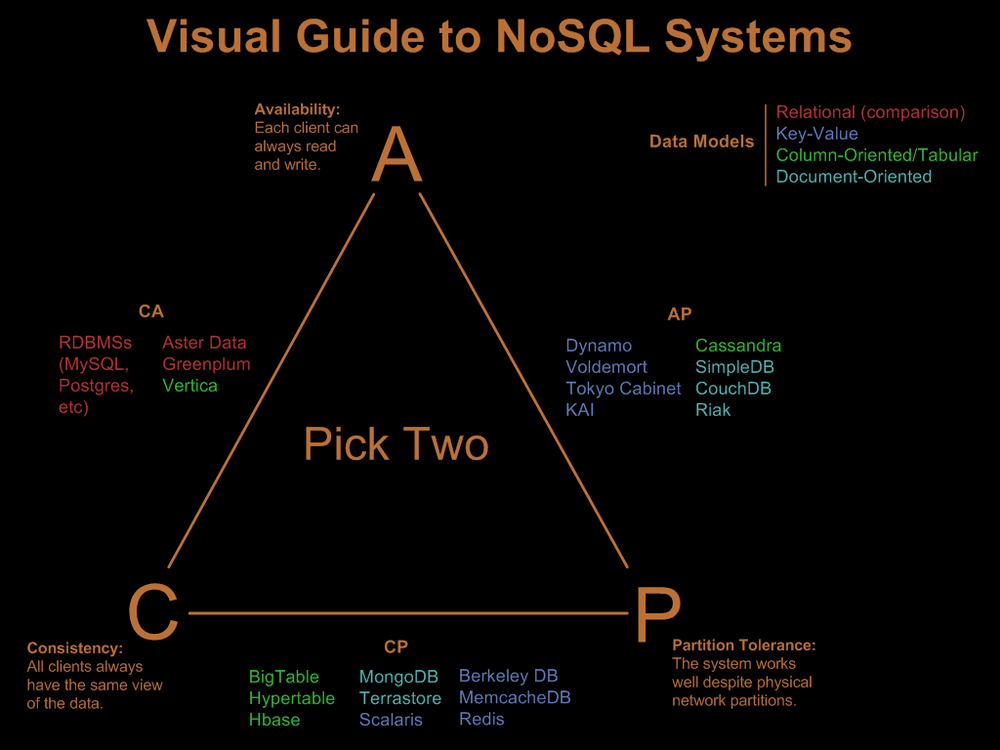

# Apache Cassandra and Wide-Column Databases

Apache Cassandra is an open-source, distributed, NoSQL database that stores data in a wide-column format, also known as a column-family format

The idea behind the Cassandra architecture is to have a P2P distributed system which is made of nodes cluster in which a node can accept the read or write requests. Every node in the cluster communicates the state information about itself and the other nodes through P2P gossip communication protocol. This together forms the basis of Cassandra data modeling and analysis.

Wide-column databases store data across flexible columns, which can be stored across multiple servers or database nodes openlogic.com. Each column family in Cassandra has a set of rows, and each row has a set of columns. Each column has a name, value, and timestamp databasetown.com.

For example, consider a column family called "users" that stores information about users. The rows could represent individual users, and the columns could represent different attributes of the user, such as name, age, and location. The data for each attribute would be stored together, in the same column, allowing for efficient data retrieval and compression databasetown.com.

Here is an example of how you might define a table in Cassandra:
```
CREATE TABLE users (
  username text PRIMARY KEY,
  first_name text,
  last_name text,
  email text,
  age int,
  address map<text, text>,
  phone_numbers set<text>,
  created_at timestamp,
  updated_at timestamp
);
```

##  Pros and Cons of Using Cassandra
Pros

Scalability: Cassandra is designed for high availability and scalability. It can handle large amounts of data and a high number of concurrent users databasetown.com.

Efficient Data Retrieval: The column-family format allows for efficient data retrieval and compression, as data for each attribute is stored together in the same column databasetown.com.

Wide-Range of Use Cases: Cassandra is well-suited for certain types of use cases, such as data warehousing, OLAP (Online Analytical Processing), real-time analytics, cloud-based analytics, and IoT databasetown.com.

Cons

Complex Querying: Unlike relational databases, Cassandra does not support complex querying, such as joins, subqueries, or transactions trustradius.com.

Limited Consistency: Cassandra prioritizes availability and partition tolerance over consistency, which can lead to stale or inconsistent data in some scenarios trustradius.com.

Learning Curve: There can be a steep learning curve when transitioning from a relational database to Cassandra, due to differences in the data model and query language trustradius.com.

In conclusion, while Cassandra and wide-column databases offer many advantages in terms of scalability and efficient data retrieval, they also have certain limitations that should be considered before deciding to use them in a project.


# CAP Theorem

The CAP theorem states that it is impossible for a distributed data store to simultaneously provide more than two out of the following three guarantees:

- Consistency: Every read receives the most recent write or an error

- Availability: Every request receives a (non-error) response, without the guarantee that it contains the most recent write

- Partition tolerance: The system continues to operate despite an arbitrary number of messages being dropped (or delayed) by the network between nodes





# Cassandra Architecture

